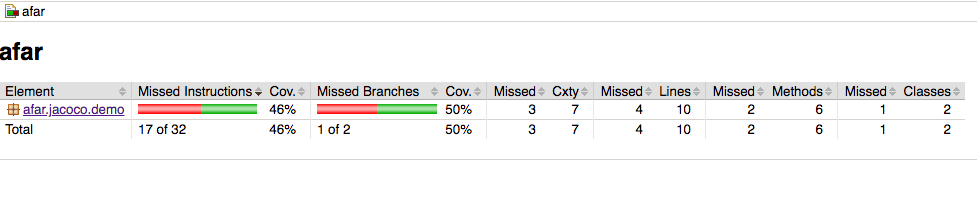
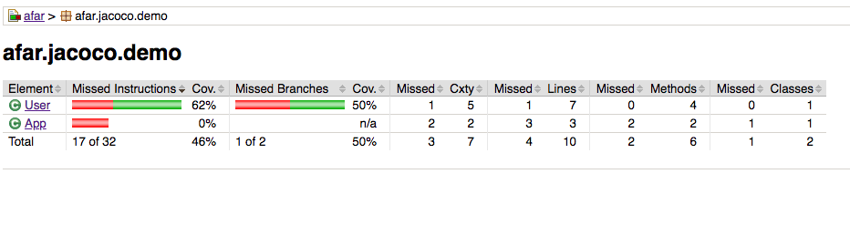
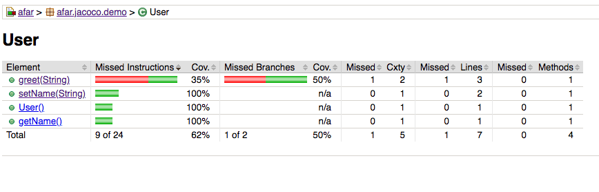
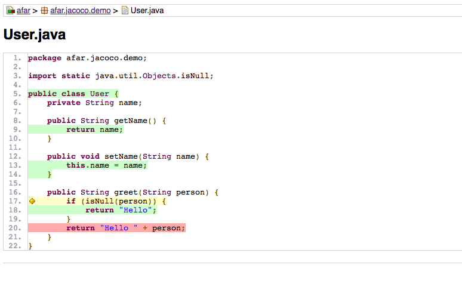
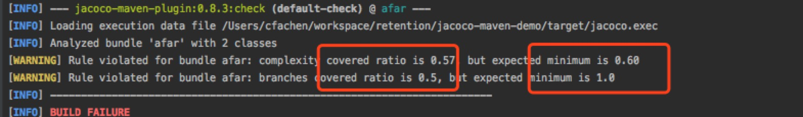

# Jacoco + Spring boot + Maven 

## 用法

在项目目录下，执行如下命令
```bash
$  ./mvnw clean verify 
```

在浏览器打开 `target/site/jacoco/index.html`，在浏览器中即可见到



点击 package `afar.jacoco.demo`，跳转到 package 内，查看其测试覆盖率情况



点击 class `User`，跳转到 class 内，查看其测试覆盖率情况



可以看到，总共有 4 个方法，而 `greet` 方法的测试覆盖率不足



点击进入 class 文件内部，可以查看每一行代码的测试覆盖情况


## 测试覆盖率配置
当前项目只在 `pom.xml` 中配置了 ***分支覆盖率***，配置如下： 

```xml
...
                        <configuration>
                            <rules>
                                <rule>
                                    <element>BUNDLE</element>
                                    <limits>
                                        <limit>
                                            <counter>COMPLEXITY</counter>
                                            <value>COVEREDRATIO</value>
                                            <minimum>0.60</minimum>
                                        </limit>
                                     </limits>
                                </rule>
                            </rules>
                        </configuration>
                    </execution>
...

```
如果要添加其他类型的覆盖率配置，请参考 
[jacoco doc](https://www.eclemma.org/jacoco/trunk/doc/counters.html)

比如，使用下面的配置就可以配置 `复杂度` 及 `分支` 两种覆盖率。

```xml
...
                        <configuration>
                            <rules>
                                <rule>
                                    <element>BUNDLE</element>
                                    <limits>
                                        <limit>
                                            <counter>COMPLEXITY</counter>
                                            <value>COVEREDRATIO</value>
                                            <minimum>0.60</minimum>
                                        </limit>
                                        <limit>
                                            <counter>BRANCHES</counter>
                                            <value>COVEREDRATIO</value>
                                            <minimum>1</minimum>
                                        </limit>
                                    </limits>
                                </rule>
                            </rules>
                        </configuration>
                    </execution>
...

```

重新执行命令，得到如下结果：

